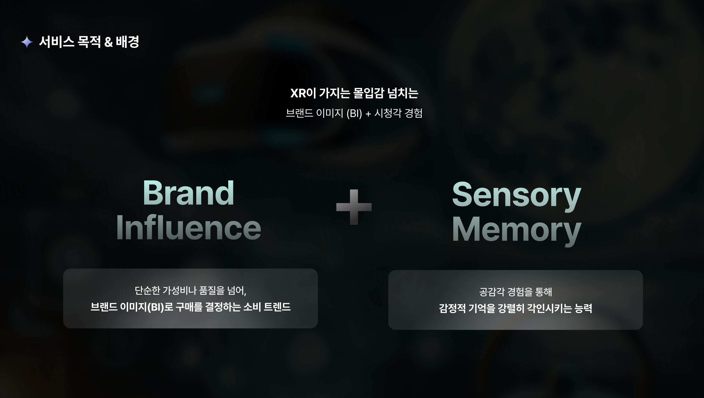
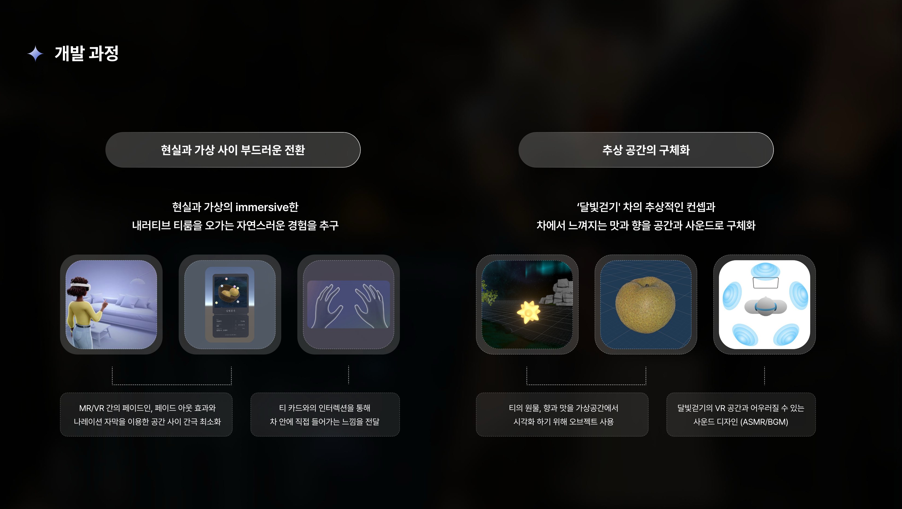

# XR 프로젝트 모음

Unity 기반으로 MR/VR 환경 프로젝트와 프로토타입 모음

---

## 1) Quad Horizon
현실의 벽을 넘어 VR로 확장되는 **MR FPS 게임**  
스텐실 셰이더로 “벽 너머” 가상 공간을 미리 보여주고, 벽이 파괴되며 적과 싸우는 게임

- 기간: 2024.12.28 – 2025.04.29 (약 4개월)
- 플랫폼: Meta Quest 3
- 인원: 1인 개발

  

<b>영상</b>

<table>
  <tr>
    <th align="center">티저(데모)</th>
    <th align="center">풀 플레이</th>
  </tr>
  <tr>
    <td align="center">
      
    </td>
    <td align="center">
      
    </td>
  </tr>
</table>

### Key
- 스텐실 기반 포탈/전환
- 벽 파괴 로직 커스텀
- XR 최적화
- XR 햅틱

---

## 2) Innerverse
시간성과 감정 변화를 주제로 한 **XR 명상**  
MR에서 시작해 황혼의 VR 공간으로 넘어가는 연출과 인터렉션에 집중

- 기간: 2025.06.24 ~ 2025.07.01 (1주)
- 플랫폼: Meta Quest 3
- 인원: 1인 개발

<b>영상</b>

  

### Key
- 손 제스처 시퀀스
- MR→VR 전환 연출
- XR 최적화

---

## 3) SeeThrough XR
보이지 않는 내부를 **투시**하고 직접 **조립/분해**하며 학습하는 XR 교육 솔루션  
Stencil 기반 렌더링

- 기간: 2024.09.03 ~ 2024.11.25 (12주)
- 플랫폼: Meta Quest 3
- 인원: 1인 개발

<b>영상</b>

  

### Key
- Stencil 기반 렌더링
- 모듈형 조립/분해 시퀀스
- 핸드 인터랙션
- 최적화

---

## 4) 90도씨
현실의 티 카드를 매개로 MR에서 시작해 VR로 이어지는 **XR 티 체험 시퀀스**

- 기간: 2024.11.18 ~ 2024.12.03 (약 3주)
- 형태: XR 기반 몰입형 MR 체험 → VR 시퀀스
- 인원: 9인 팀 프로젝트 (Dev 팀장)

  

<b>영상</b>

  

### 프로젝트 목적
- MR에서 시작해 VR로 넘어가는 **연속 시퀀스 경험**
- 카드(현실 오브젝트)를 매개로 “진입”을 설득력 있게 만들기
- 시청각 요소까지 포함해 **분위기 유지**에 집중

<b>서비스/배경</b>

  

  

<b>개발 과정</b>

  

### 체험 구성
- **0단계 (기본 UX)**
- **1단계 (티 카드 상호작용 / 진입 연출)**
- **2단계 (분위기 전환)**
- **3단계 (현실 체험 구간 → VR 전환)**
- **4단계 (VR 감상 구간)**

<b>VR 공간</b>

  

<b>유저 테스트</b>

  

  

---

## 5) VR Jenga
Meta Quest 3 환경에서 젠가 블록을 조작하는 VR 게임

- 플랫폼: Meta Quest 3
- 인원: 1인 개발
  

  

### Key
- 버튼 오브젝트 클릭으로 젠가블록 리빌딩

---

## 6) XR-ProtoSpace

<b>기능 데모</b>

  
  &nbsp;&nbsp;
  
    
  
  &nbsp;&nbsp;
  
    
  
  &nbsp;&nbsp;
  

   
  <b>MR 줄자</b> · 현실 공간 거리 측정
   
  <b>MR Effect Mesh</b> · 스캔된 공간 메시 시각화
    
  <b>컨트롤러 슈팅</b> · 입력에 따라 투사체/이펙트 분기
   
  <b>VR 패스스루 창</b> · VR 공간 안에 현실이 보이는 창 연출
    
  <b>MR 창(Stencil Mask)</b> · 현실/가상 경계를 창 형태로 구성
   
  <b>MR 미니 슈팅</b> · 적 생성 + 슈팅 입력 결합 미니 게임

